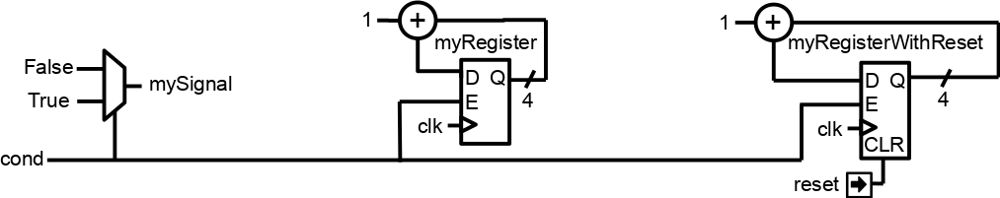

.. _foreword:

Foreword
========

Preliminary notes:

* All the following statements will be about describing digital hardware.
  Verification is another tasty topic.
* For conciseness, let's assume that SystemVerilog is a recent revision of
  Verilog.
* When reading this, we should not underestimate how much our attachment for our
  favorite HDL will bias our judgement.

Why moving away from traditional HDL
------------------------------------

VHDL/Verilog aren't Hardware Description Languages
^^^^^^^^^^^^^^^^^^^^^^^^^^^^^^^^^^^^^^^^^^^^^^^^^^

Those languages are event driven languages created initially for
simulation/documentation purposes. Only in a second time they were used as
inputs languages for synthesis tools. Which explain the roots of a lot of the
following points.

Event driven paradigm doesn't make any sense for RTL
^^^^^^^^^^^^^^^^^^^^^^^^^^^^^^^^^^^^^^^^^^^^^^^^^^^^

When you think about it, describing digital hardware (RTL) by using
process/always blocks doesn't make any practical senses. Why do we have to worry
about a sensitivity list? Why do we have to split our design between
processes/always blocks of different natures (combinatorial logic / register
without reset / register with async reset)?

For instance, to implement this:

Using VHDL processes you write this:

.. code-block:: vhdl

   signal mySignal : std_logic;
   signal myRegister : unsigned(3 downto 0);
   signal myRegisterWithReset : unsigned(3 downto 0);

   process(cond)
   begin
       mySignal <= '0';
       if cond = '1' then
           mySignal <= '1';
       end if;
   end process;

   process(clk)
   begin
       if rising_edge(clk) then
           if cond = '1' then
               myRegister <= myRegister + 1;
           end if;
       end if;
   end process;

   process(clk,reset)
   begin
       if reset = '1' then
           myRegisterWithReset <= 0;
       elsif rising_edge(clk) then
           if cond = '1' then
               myRegisterWithReset <= myRegisterWithReset + 1;
           end if;
       end if;
   end process;

Using SpinalHDL you write this:

.. code-block:: scala

   val mySignal             = Bool()
   val myRegister           = Reg(UInt(4 bits))
   val myRegisterWithReset  = Reg(UInt(4 bits)) init(0)

   mySignal := False
   when(cond) {
       mySignal            := True
       myRegister          := myRegister + 1
       myRegisterWithReset := myRegisterWithReset + 1
   }

As for everything, you can get used to this event driven semantic, until you
taste something better.

Recent revisions of VHDL and Verilog aren't usable
^^^^^^^^^^^^^^^^^^^^^^^^^^^^^^^^^^^^^^^^^^^^^^^^^^

The EDA industry is really slow to implement VHDL 2008 and SystemVerilog
synthesis capabilities in their tools. Additionally, when it's done, it appear
that only a constraining subset of the language is implemented (not talking
about simulation features). It result that using any interesting feature of
those language revision isn't safe as:

* It will probably make your code incompatible with many EDA tools.
* Other companies will likely not accept your IP as their flow isn't ready for
  it.

Anyway, those revisions don't change the heart of those HDL issues: they are
based on a event driven paradigm which doesn't make sense to describe digital
hardware.

VHDL records, Verilog struct are broken (SystemVerilog is good on this, if you can use it)
^^^^^^^^^^^^^^^^^^^^^^^^^^^^^^^^^^^^^^^^^^^^^^^^^^^^^^^^^^^^^^^^^^^^^^^^^^^^^^^^^^^^^^^^^^

You can't use them to define an interface, because you can't define their
internal signal directions. Even worst, you can't give them construction
parameters! So, define your RGB record/struct once, and hope you never have to
use it with bigger/smaller color channels...

Also a fancy thing with VHDL is the fact that if you want to add an array of
something into a component entity, you have to define the type of this array
into a package... Which can't be parameterized...

For instance, below is a SpinalHDL APB3 bus definition:

.. code-block:: scala

   // Class which can be instantiated to represent a given APB3 configuration
   case class Apb3Config(
     addressWidth  : Int,
     dataWidth     : Int,
     selWidth      : Int     = 1,
     useSlaveError : Boolean = true
   )

   // Class which can be instantiated to represent a given hardware APB3 bus
   case class Apb3(config: Apb3Config) extends Bundle with IMasterSlave {
     val PADDR      = UInt(config.addressWidth bits)
     val PSEL       = Bits(config.selWidth bits)
     val PENABLE    = Bool()
     val PREADY     = Bool()
     val PWRITE     = Bool()
     val PWDATA     = Bits(config.dataWidth bits)
     val PRDATA     = Bits(config.dataWidth bits)
     val PSLVERROR  = if(config.useSlaveError) Bool() else null  // Optional signal

     // Can be used to setup a given APB3 bus into a master interface of the host component
     // `asSlave` is automatically implemented by symmetry
     override def asMaster(): Unit = {
       out(PADDR, PSEL, PENABLE, PWRITE, PWDATA)
       in(PREADY, PRDATA)
       if(config.useSlaveError) in(PSLVERROR)
     }
   }

Then about the VHDL 2008 partial solution and the SystemVerilog
interface/modport, lucky you are if your EDA tools / company flow / company
policy allow you to use them.

VHDL and Verilog are so verbose
^^^^^^^^^^^^^^^^^^^^^^^^^^^^^^^

Really, with VHDL and Verilog, when it starts to be about component
instantiation interconnection, the copy-paste god has to be invoked.

To understand it more deeply, below is a SpinalHDL example performing some
peripherals instantiation and adding the APB3 decoder required to access them.

.. code-block:: scala

   // Instantiate an AXI4 to APB3 bridge
   val apbBridge = Axi4ToApb3Bridge(
     addressWidth = 20,
     dataWidth    = 32,
     idWidth      = 4
   )

   // Instantiate some APB3 peripherals
   val gpioACtrl = Apb3Gpio(gpioWidth = 32)
   val gpioBCtrl = Apb3Gpio(gpioWidth = 32)
   val timerCtrl = PinsecTimerCtrl()
   val uartCtrl = Apb3UartCtrl(uartCtrlConfig)
   val vgaCtrl = Axi4VgaCtrl(vgaCtrlConfig)

   // Instantiate an APB3 decoder
   // - Driven by the apbBridge
   // - Map each peripheral in a memory region
   val apbDecoder = Apb3Decoder(
     master = apbBridge.io.apb,
     slaves = List(
       gpioACtrl.io.apb -> (0x00000, 4 KiB),
       gpioBCtrl.io.apb -> (0x01000, 4 KiB),
       uartCtrl.io.apb  -> (0x10000, 4 KiB),
       timerCtrl.io.apb -> (0x20000, 4 KiB),
       vgaCtrl.io.apb   -> (0x30000, 4 KiB)
     )
   )

Done. That's all. You don't have to bind each signal one by one when you
instantiate a module/component because you can access their interfaces in a
object-oriented manner.

Also about VHDL/Verilog struct/records, we can say that they are really dirty
tricks, without true parameterization and reusability capabilities, trying to
hide the fact that those languages were poorly designed.

Meta Hardware Description capabilities
^^^^^^^^^^^^^^^^^^^^^^^^^^^^^^^^^^^^^^

Basically VHDL and Verilog provide some elaboration tools which aren't directly
mapped into hardware as loops / generate statements / macro / function /
procedure / task. But that's all.

And even then, they are really limited. For instance, one can't define
process/always/component/module blocks into a task/procedure. It is really a
bottleneck for many fancy things.

With SpinalHDL you can call a user-defined task/procedure on a bus like that:
``myHandshakeBus.queue(depth=64)``. Below is some code including the definition.

.. code-block:: scala

   // Define the concept of handshake bus
   class Stream[T <: Data](dataType:  T) extends Bundle {
     val valid   = Bool()
     val ready   = Bool()
     val payload = cloneOf(dataType)

     // Define an operator to connect the left operand (this) to the right operand (that)
     def >>(that: Stream[T]): Unit = {
       that.valid := this.valid
       this.ready := that.ready
       that.payload := this.payload
     }

     // Return a Stream connected to this via a FIFO of depth elements
     def queue(depth: Int): Stream[T] = {
       val fifo = new StreamFifo(dataType, depth)
       this >> fifo.io.push
       return fifo.io.pop
     }
   }

Let's see further, imagine you want to define a state machine. With VHDL/Verilog
you have to write a lot of raw code with some switch statements to do it. You
can't define the notion of "StateMachine", which would give you a nice syntax to
define each state. Else you can use a third-party tool to draw your state
machine and then generate your VHDL/Verilog equivalent code...

Meta-hardware description capabilities of SpinalHDL enable you to define your
own tools which then allow you to define things in abstracts ways, as for state
machines.

Below is an simple example of the usage of a state machine abstraction defined
on the top of SpinalHDL:

.. code-block:: scala

   // Define a new state machine
   val fsm = new StateMachine {
     // Define all states
     val stateA, stateB, stateC = new State

     // Set the entry point
     setEntry(stateA)

     // Define a register used into the state machine
     val counter = Reg(UInt(8 bits)) init (0)

     // Define the state machine behavior for each state
     stateA.whenIsActive (goto(stateB))

     stateB.onEntry(counter := 0)
     stateB.onExit(io.result := True)
     stateB.whenIsActive {
       counter := counter + 1
       when(counter === 4) {
         goto(stateC)
       }
     }

     stateC.whenIsActive(goto(stateA))
   }

Imagine you want to generate the instruction decoding of your CPU. It could
require some fancy elaboration time algorithms to generate the less logic
possible. But in VHDL/Verilog, your only option to do these kind of things is to
write a script which generates the ``.vhd`` and ``.v`` that you want.

There is really much to say about meta-hardware description, but the only true
way to understand it and get its real taste is to experiment it. The goal with
it is to stop playing with wires and gates, to start taking some distance with
that low level stuff, to think reusable.
