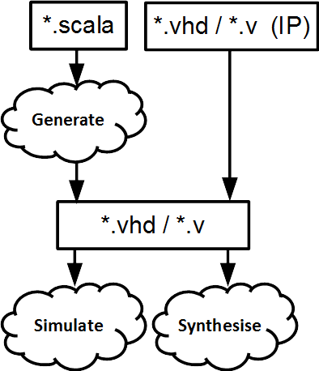

.. _Introduction/SpinalHDL:

About SpinalHDL
---------------

What is SpinalHDL?
^^^^^^^^^^^^^^^^^^

SpinalHDL is an open source high-level hardware description language with
associated tools. Its development started in December 2014.

SpinalHDL makes it possible to efficiently describe hardware, giving names to
digital hardware notions; the most obvious examples are ``Reg`` and ``Latch``.
In event-driven languages such as VHDL and Verilog, to use these two common
elements, the user has to describe how to simulate them with a process, so that
the synthesis tool can infer what cell it is. With SpinalHDL, you just have to
declare a ``Reg`` or a ``Latch``.

SpinalHDL is a *domain-specific language* based on Scala a general-purpose
language. It brings several benefits:

* There are free integrated development environments supporting it, providing
  many features that simple text editors don't have:

    * syntax and type errors are highlighted right in the code
    * correct renaming, even across files
    * smart auto completion / suggestions
    * navigation tools (go to definition, show all references, etc.)

* It allows to implement simple to complex hardware generators (meta-hardware
  description) with no need to deal with several languages.

.. note::

   `Scala <https://scala-lang.org/>`_ is a statically-typed, functional and
   object-oriented language using the Java virtual machine (JVM).

What SpinalHDL is not
^^^^^^^^^^^^^^^^^^^^^

SpinalHDL is not an HLS tool: its goal is not to automagically transform an
abstract algorithm into a digital circuit. Its goad is to create a new
abstraction level by naming things, to help the designer reuse their code and
not write the same thing over and over again.

SpinalHDL is not an analog modeling language. VHDL and Verilog make it possible
for analog designers to provide a model of their IP to digital designers.
SpinalHDL does not address this case, and is for digital designers to describe
their own digital designs.

The Spinal development flow
^^^^^^^^^^^^^^^^^^^^^^^^^^^

Once code is written in *SpinalHDL*, the tool can:

* Generate VHDL, Verilog or SystemVerilog, to instantiate it in one of these
  languages or give it to any simulator or synthesis tool. There is no logic
  overhead, hierarchy and names are preserved, and it runs design checks during
  generation.
* Boot a simulation using Verilator or another supported simulator.

As SpinalHDL is interoperable with VHDL and (System)Verilog, you can both
instantiate SpinalHDL IPs in these language (using generated code) and
instantiate IPs in these languages in SpinalHDL (using ``BlackBox``).

.. note::

   SpinalHDL is *fully interoperable* with standard VHDL/Verilog-based EDA tools
   (simulators and synthetizers) as the output generated by the toolchain can be
   VHDL or Verilog.

Advantages of using SpinalHDL over VHDL / Verilog
^^^^^^^^^^^^^^^^^^^^^^^^^^^^^^^^^^^^^^^^^^^^^^^^^

As SpinalHDL is based on a high-level language, it provides several advantages to improve your hardware coding:

#. **No more endless wiring** - Create and connect complex buses like AXI in one single line.
#. **Evolving capabilities** - Create your own bus definitions and abstraction layers.
#. **Reduce code size** - By a high factor, especially for wiring. This enables you to have a better overview of your code base, increase your productivity and create fewer headaches.
#. **Free and user friendly IDE** - Thanks to Scala tools for auto-completion, error highlighting, navigation shortcuts, and many others.
#. **Powerful and easy type conversions** - Bidirectional translation between any data type and bits. Useful when loading a complex data structure from a CPU interface.
#. **Design checks** - Early stage lints to check that there are eg no combinatorial loops / latches.
#. **Clock domain safety** - Early stage lints to inform you that there are no unintentional clock domain crossings.
#. **Generic design** - There are no restrictions to the genericity of your hardware description by using Scala constructs.
